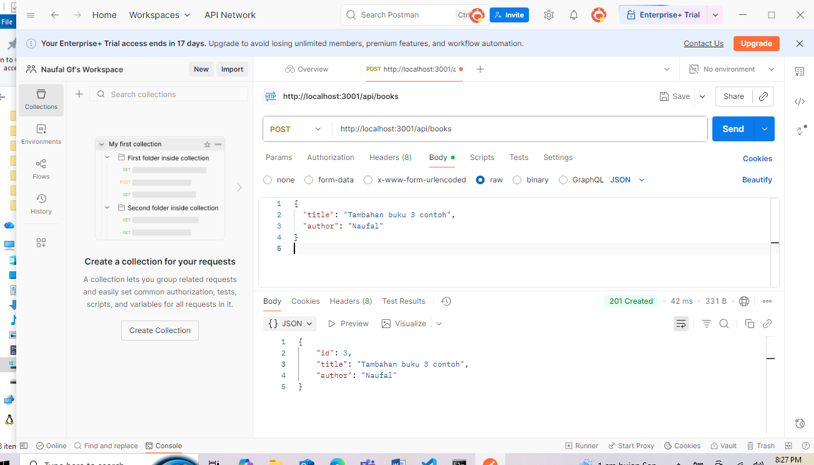
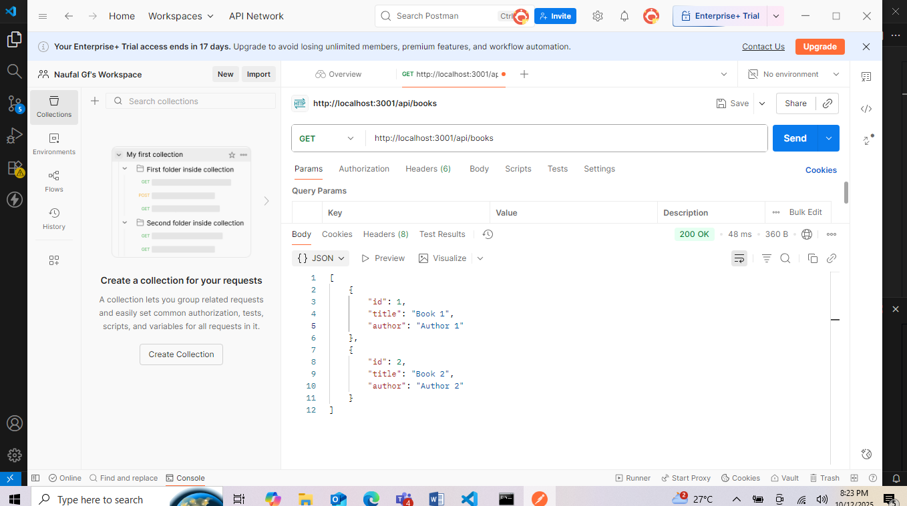
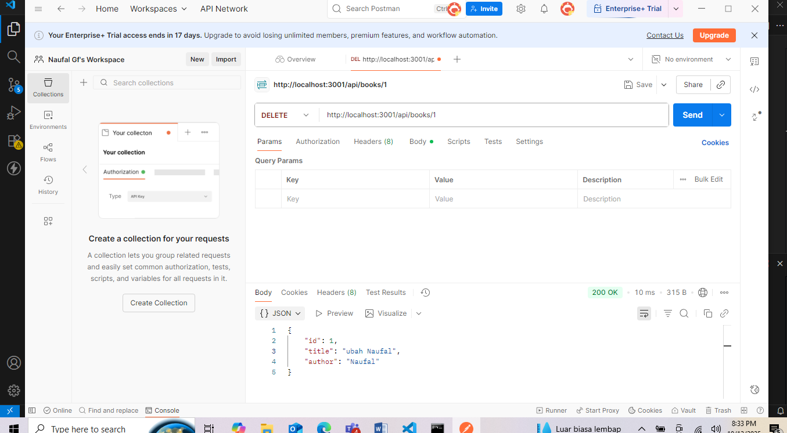

# Tugas 2
1.Tampilan End Point Create Book:

2.Tampilan End Point Read Book:

3.Tampilan End Point Read Book (buku tertentu):

4.Tampilan End Point Update Book:

5.Tampilan End Point Delete Book:

