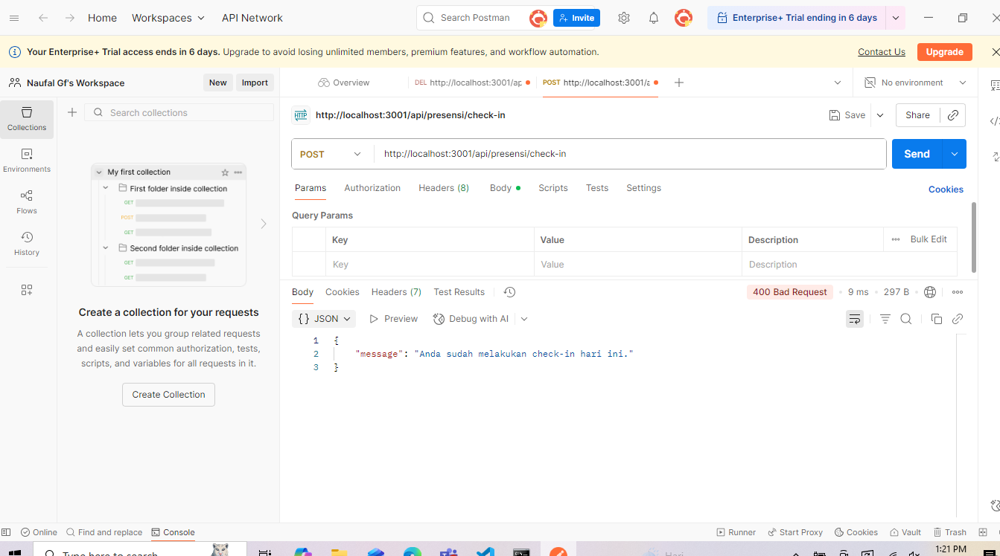

1.Tampilan End Point CheckIn:
   
2.Tampilan End Point CheckIn lebih dari 1 kali:
   
3.Tampilan End Point ChekOut:
   
4.Tampilan End Point CheckOut tanpa CheckIn:
   
5.Tampilan End Point ReportsDaily:
   