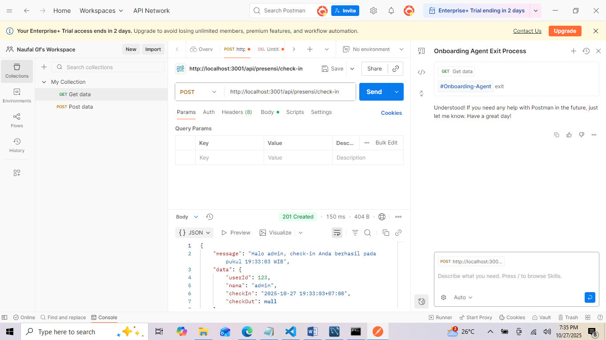
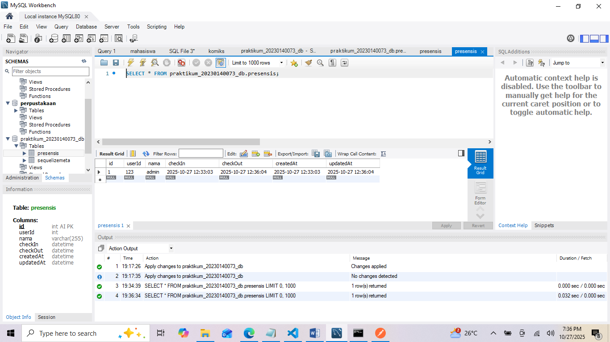
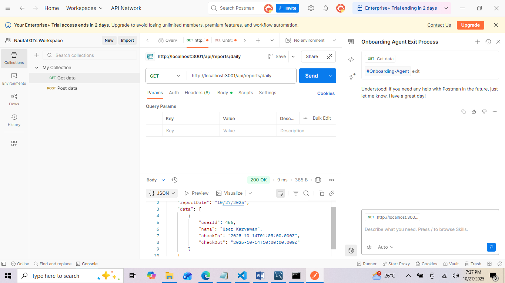

1.Tampilan End Point CheckIn:
   
2.Tampilan End Point CheckIn di Database Mysql:
   
3.Tampilan End Point ChekOut:
   
4.Tampilan End Point CheckOut di Database Mysql:
   
5.Tampilan End Point ReportsDaily:
   