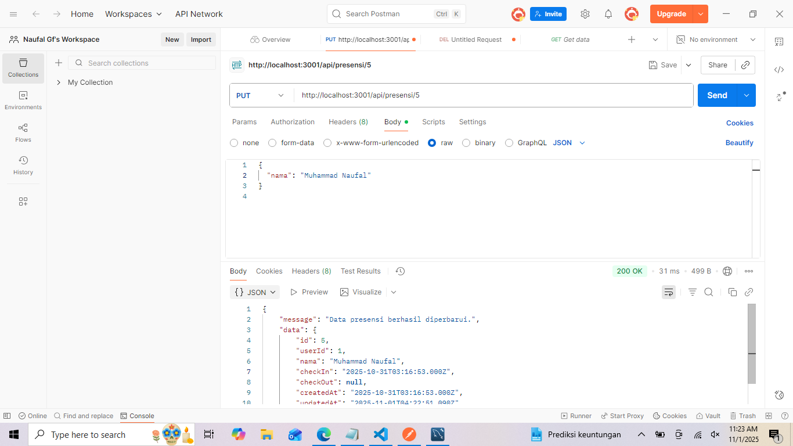
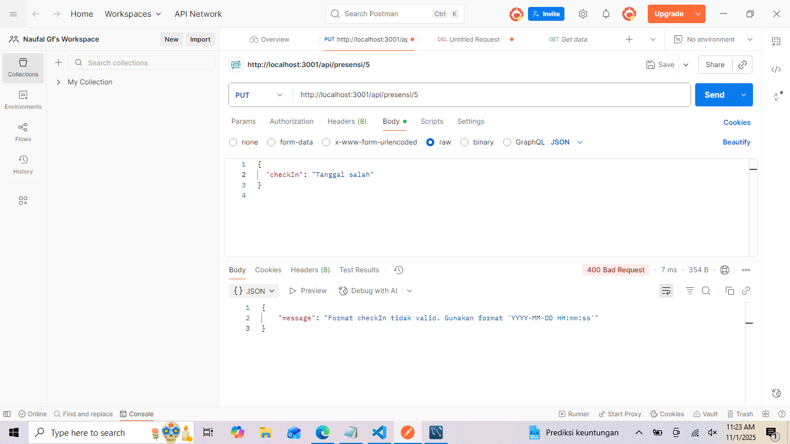
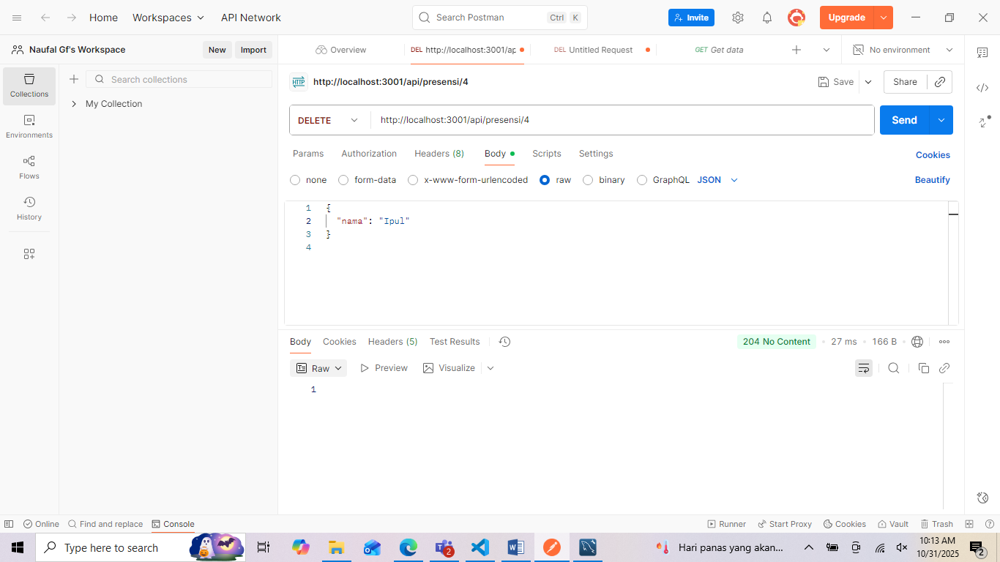
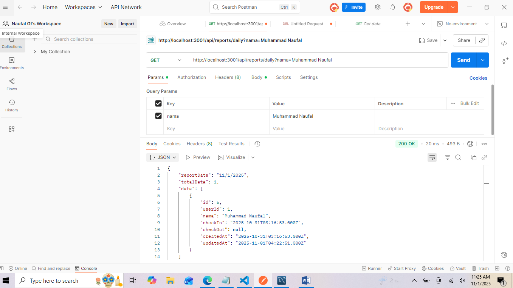

1.Tampilan End Point Update Data Presensi:
   
2.Tampilan End Point untuk Update Tanggal CheckIn jika salah:
   
3.Tampilan End Point Delete data presensi:
   
4.Tampilan End Point Search berdasarkan Nama:
   
5.Tampilan End Point Berdasarkan tanggalmulai dan selesai:
   